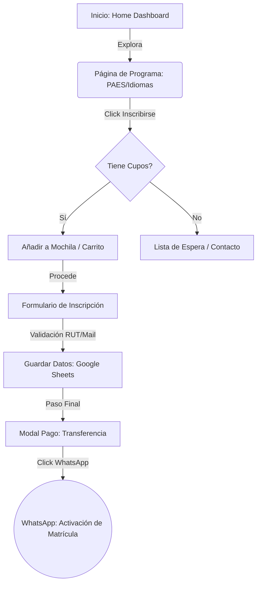
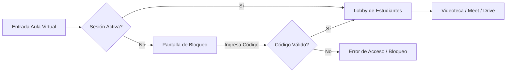

# 🏗️ Arquitectura de Ingeniería: Instituto Lael 2.0

Este documento detalla la lógica de flujo y seguridad de la plataforma para asegurar escalabilidad y robustez.

---

## 🗺️ 1. User Journey (Conversion Flow)
Este diagrama describe el camino que recorre un usuario desde el descubrimiento hasta el cierre de la venta.

---

## 🔒 2. Aula Security Flow
Lógica de protección del contenido exclusivo para alumnos premium.

---

## ⚙️ 3. Stack Tecnológico
*   **Frontend:** React.js + Tailwind CSS + Framer Motion.
*   **Analytics:** Google Analytics 4 (Event Tracking).
*   **Persistence:** LocalStorage (Carrito) & SessionStorage (Aula).
*   **Backend Prep:** Webhook Hook (POST) para automatización de registros.
